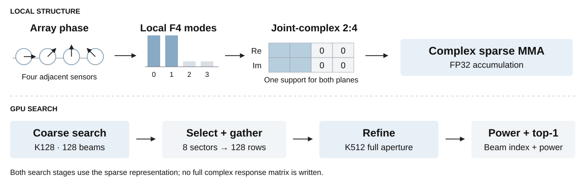

# Beam24: Exploiting Regular-Array Phase Structure for 2:4 Sparse Tensor-Core Beamforming

[](LICENSE) [](https://developer.nvidia.com/cuda-toolkit) [](#performance-contract)

Beam24 is a signal-to-hardware co-design for multi-beam processing on regularly
sampled line arrays. It converts local phase structure into hardware-legal
**joint-complex 2:4 sparsity**, converts angular locality into a fixed refinement
tile, and preserves both structures through Sparse Tensor Core execution,
beam-power reduction, and GPU top-1 selection.

<p align="center">
  
</p>

<p align="center"><sub>Signal structure determines the sparse representation; the GPU pipeline preserves it through the final consumer.</sub></p>

At the primary K512 operating point, the complete pipeline takes **0.470 ms**,
is **3.88×** faster than the fastest measured external implementation of the
identical hierarchy, and matches dense-GPU top-1 in **99.93%** of held-out
finite-snapshot trials. The measured scope is SM120a, regular-line-array top-1;
the repository does not extrapolate to arbitrary geometry or GPU generations.

## Why dense beamforming does not map to 2:4

For $M$ beams, $K$ sensors, and $N$ snapshots, multi-beam processing
computes

$$
\mathbf{Y}=\overline{\mathbf{W}}\mathbf{X},
\qquad
\mathbf{W}\in\mathbb{C}^{M\times K},
\quad
\mathbf{X}\in\mathbb{C}^{K\times N}.
$$

Here $\mathbf{W}$ contains nonconjugated steering rows. Regular-array steering
weights are dense along the reduction dimension, while Sparse Tensor Cores
require two zeros in every aligned group of four values in the sparse operand.
Directly removing antenna-domain coefficients changes coherent accumulation and
degrades the spatial response.

On ten real 48-sensor VLA recordings, direct joint-complex 2:4 selection gives
only **0.97075** mean spatial-spectrum correlation and matches the dense peak
on **10%** of recordings. The hardware format is useful; the naive
representation is not.

## Signal-to-hardware co-design

Adjacent sensors in a regular line array follow a predictable local phase
progression. Let $\mathbf{F}$ be block diagonal with unitary four-point
transforms. Beamforming admits the exact change of basis

$$
\overline{\mathbf{W}}\mathbf{X}
=\overline{(\mathbf{W}\mathbf{F})}(\mathbf{F}\mathbf{X})
=\overline{\mathbf{U}}\mathbf{Z}.
$$

The change of basis is exact. Within each four-sensor block, the transformed
steering progression concentrates in two adjacent modes. Beam24 retains one
two-of-four support for the complete complex coefficient, so the real and
imaginary planes share one metadata pattern across all four real products.

Across beams, a centered subarray selects eight sectors that expand into one
fixed 128-row full-aperture tile. This avoids an irregular candidate list while
evaluating 15.6% of exhaustive beam--sensor work at the primary shape. The GPU
producer fuses $\mathbf{F}\mathbf{X}$, the sparse executor retains FP32 complex
accumulators, and the epilogue reduces $|Y|^2$ and selects top-1 without writing
the 2-GiB complex output.

Approximation begins only when two transformed modes and a bounded set of beam
sectors are retained; the coordinate change and every emitted 2:4 group remain
exactly legal by construction.

## Cross-layer design

### 1. Signal-structured support

Beam24 chooses a single two-of-four support for each complex group. Sharing the
support between real and imaginary weights preserves complex semantics and
allows one sparse metadata stream to drive all four real products.

Mask quality is evaluated in the spatial-response domain rather than by
coefficient error alone. This is why the local-F4 representation recovers
**0.999975** mean spectrum correlation on the real VLA recordings while direct
antenna-domain 2:4 does not.

### 2. Full-complex Sparse Tensor-Core operator

For $\widehat{\mathbf{Y}}=\overline{\mathbf{S}}\mathbf{Z}$, each complex tile
is assembled from

$$
\widehat{\mathbf{Y}}_{r}=\mathbf{S}_{r}\mathbf{Z}_{r}
                 +\mathbf{S}_{i}\mathbf{Z}_{i},
\qquad
\widehat{\mathbf{Y}}_{i}=\mathbf{S}_{r}\mathbf{Z}_{i}
                 -\mathbf{S}_{i}\mathbf{Z}_{r}.
$$

Beam24 maps these four terms to sparse MMA instructions while retaining the
real and imaginary accumulator planes across the reduction loop. The SM120a
kernel uses warp-specialized producer/consumer roles, a two-stage TMA pipeline,
shared-memory local transforms, `ldmatrix` fragment loads, and FP32
accumulation.

### 3. Same-output system fusion

An operator-only comparison can hide the cost of downstream materialization.
Beam24 therefore includes an internal dense Tensor-Core attribution control
with the same final output contract: one FP32 maximum beam power and one beam
index per batch. Both paths perform beamforming, power reduction, and top-1
selection; only the representation and matrix engine differ.

## Results

### Signal quality

| Configuration | Dataset / geometry | Mean spectrum correlation | Dense-peak agreement | Mean peak shift |
|---|---|---:|---:|---:|
| Dense reference | SPIB/SACLANT, 48-sensor VLA, 10 recordings | 1.000000 | 100% | 0.000° |
| Direct joint 2:4 | Same data and beamformer | 0.970747 | 10% | 0.225° |
| **Beam24 local-F4 joint 2:4** | Same data and beamformer | **0.999975** | **90%** | **0.025°** |
| Beam24 local-F4 joint 2:4 | LOCATA Eigenmike, spherical geometry | 0.930901 | 11.1% | unsupported |

The Eigenmike row is a deliberate negative boundary: the current construction
is for regularly sampled line arrays, not arbitrary array geometry.

The hierarchical top-1 route exactly matched exhaustive Beam24 on 481 ideal
ULA source angles, ten SPIB recordings, 2,000 incoherent two/three-source ULA
mixtures, and 500 coherent 64-snapshot mixtures. These results support top-1
selection on regularly sampled line arrays; they do not establish general
top-k recovery or arbitrary-array support.

The finite-snapshot GPU campaign runs the complete FP16-input/FP32-power path
on 33,792 held-out K512 trials. Beam24 matches dense GPU top-1 in 99.929% of
trials; all 24 differences are one grid cell, and hierarchy adds no miss over
exhaustive Local-F4. Five repeated replays are index-stable, with zero packed-A,
metadata, or nonfinite errors.

On 15 held-out SPIB P2701 moving-source and A2601_2 recordings, Local-F4
matches dense top-1 in every file with zero grid shift and mean spectrum
correlations of 0.999965 and 0.998332. The proportional K48 hierarchy fails on
the same sessions, so they extend the local representation evidence but not
the global search claim.

### GPU performance

At the primary K512 system shape, the integrated hierarchy includes Stage 1,
device top-8 selection, packed-weight gather, sparse-metadata repacking, Stage
2, and mapped top-1 in the timed region.

| Scope | Comparator and role | Speedup | 95% paired bootstrap CI | Wins |
|---|---|---:|---:|---:|
| End-to-end top-1 | **External:** ccglib materialized-top1 | **10.837x** | [10.829, 10.843] | 6/6 |
| Same hierarchy | **External:** ccglib dynamic-A hierarchy | **3.880x** | [3.879, 3.881] | 6/6 |
| Same sparse executor | **Ablation:** exhaustive Beam24 | **4.565x** | [4.561, 4.569] | 6/6 |
| Same hierarchy | **Attribution:** internal dense-fused control | **1.160x** | [1.159, 1.161] | 6/6 |

The 10.837x row is the complete application result and intentionally includes
hierarchical work reduction, sparse execution, and avoidance of materialized
complex output. The 3.880x row applies the identical hierarchy to the fastest
measured external dynamic-A path, closing the same-algorithm fairness
comparison. The exhaustive and dense-fused rows isolate the algorithmic and
sparse-executor contributions. Hierarchy uses 36,056,064 bytes of dynamic
candidate workspace and retains the exhaustive route when
`batch × snapshots < 3072`, where its fixed multi-launch cost is slower on the
measured SM120a K512 route.

An independent 46,080-trial hierarchy audit separates 39,936 admitted K512
cases from 6,144 close-source stress cases. Every admitted exhaustive Local-F4
winner appears within the first four Stage-1 sectors: top-1/top-2/top-4 recall
is 97.539%/99.679%/100%. Fixed top-8 therefore adds hardware-aligned slack for
the 128-row Stage-2 tile. Close coherent stress produces two top-8 misses and a
maximum coverage rank of 37, so no arbitrary-signal recall guarantee is made.

A second measured point at batch64, M1024, N512, K512 retains 2.386x over the
external identical-hierarchy path, 3.886x from global hierarchy, and 1.106x
from local sparse execution, with 6/6 wins for every comparison. This is a
shape-local replication on the same GPU, not cross-GPU evidence.

The strongest same-grid Fourier control uses a quality-passing 4096-point FP32
cuFFT, linear complex interpolation, and direct power/top-1. It streams two
batches at a time, reducing the full-spectrum workspace from 8 GiB to 64 MiB.
The maintained implementation takes 7.769 ms versus 0.4708 ms for Beam24, a
paired 16.498x ratio with 95% CI [16.484, 16.512] and 6/6 wins. These results do
not bound every specialized NUFFT or CZT. Superseded and rejected Fourier
routes are separated under `baselines/history/` and
`docs/HISTORICAL_FOURIER_CONTROLS.md`.

The exhaustive results below remain the representation/executor controls with
no hierarchical work reduction.

All rows below use an NVIDIA RTX PRO 6000 Blackwell Workstation Edition,
$B=256$, $M=N=1024$, $K=512$, complex FP16 inputs, and FP32
accumulation. Each speedup is the paired geometric mean of six independent
direction-balanced processes.

| Scope | Comparator and role | Beam24 speedup | 95% paired bootstrap CI | Wins |
|---|---|---:|---:|---:|
| Full complex output | ccglib opt-static-A | **1.47097x** | [1.46888, 1.47308] | 6/6 |
| Beamforming + power + top-1 | **External:** materialized ccglib pipeline | **2.37665x** | [2.37546, 2.37791] | 6/6 |
| Beamforming + power + top-1 | **Attribution:** internal dense-fused control | **1.50462x** | [1.50362, 1.50582] | 6/6 |

The 2.37665x row is the exhaustive-path external system control and includes
the generally applicable benefit of avoiding complex-output materialization.
The 1.50462x row is its matched internal attribution after applying the same
output fusion to dense Tensor Cores. The primary hierarchical result remains the
hierarchical 10.837x complete result paired with the 3.880x same-algorithm
external comparison above.

The completed multi-K campaign additionally measures Beam24 over the fastest
ccglib configuration at **1.107x / 1.143x / 1.465x** for K64/K128/K512. The
same-output dense-fused attribution ratios are **1.630x / 1.593x / 1.505x**.
These are independent replication rows, not replacements for the canonical
K512 campaigns. See [the evaluation suite](baselines/README.md) for contract
separation.

A fresh-checkout validation rebuilt the SM120a targets, passed numerical
checks and Compute Sanitizer with zero errors, and reproduced the internal
dense-fused attribution at **1.50431x**, with wins in all six processes.

## Performance contract

| Item | Validated setting |
|---|---|
| GPU | NVIDIA RTX PRO 6000 Blackwell Workstation Edition, compute capability 12.0 |
| CUDA | 13.0–13.3; validation run used 13.2.51 |
| Input / accumulation | Planar complex FP16 / FP32 |
| Primary shape | batch=256, M=1024, N=1024, K=512 |
| Timing | CUDA events, device-resident inputs, 20 warmups, 100 iterations |
| Repetition | Six independent AB/BA processes under one GPU lock |
| System output | One FP32 maximum power and one beam index per batch |
| Complex output workspace | 0 B in production `check=0`; allocated only for correctness oracle |
| Static preparation | Steering-weight transform and compression amortized |

The repository does not extrapolate these numbers to unmeasured shapes,
precisions, GPU generations, host-transfer-inclusive execution, or multi-GPU
systems.

## Reproduce

### CPU smoke test

```bash
python3 -m venv .venv
source .venv/bin/activate
python3 -m pip install -r requirements.txt
./artifact/reproduce.sh smoke
```

This validates the result anchors, repository contracts, and a bounded
synthetic ULA quality case without requiring a GPU or external dataset.

### SM120a correctness

```bash
cmake --preset sm120
cmake --build --preset sm120
./artifact/reproduce.sh gpu-smoke
```

The target builds the sparse operator, internal dense-fused control, exhaustive
fused system, and hierarchical system; checks high-entropy numerical cases;
and runs Compute Sanitizer when it is available.

### Real VLA quality

```bash
./artifact/scripts/get_data.sh spib
export BEAM24_DATA_ROOT="$PWD/work/datasets"
./artifact/reproduce.sh quality
```

### Synthetic perturbation robustness

```bash
./artifact/reproduce.sh robustness
```

This CPU-only target runs three held-out seeds and 3,072 continuous-angle K512
ULA trials per condition. It validates the bounded top-1 claim and preserves
the rejected full-spectrum robustness gate as counterevidence. The same target
also runs a disjoint 46,080-trial margin/coverage audit over top-L budgets and
retains close coherent-source misses as the fixed-L worst-case boundary.

### Streamed Fourier control

```bash
./artifact/reproduce.sh fourier-control
```

This SM120 target rebuilds the bounded-workspace L4096 cuFFT top-1 control,
checks its deterministic output and memory safety, and runs six paired
Fourier/Beam24 process orderings.

### Internal same-output attribution campaign

```bash
./artifact/reproduce.sh system
```

The system target fails closed unless an SM120 GPU and supported CUDA toolkit
are present. It records every process log under a fresh `artifact/runs/`
directory and reports the internal dense-fused attribution against the
checked-in reference. The primary external ccglib system result is retained in
the checked-in external-baseline evidence.

### Hierarchical system campaign

```bash
./artifact/reproduce.sh hierarchy
```

This target rebuilds the exhaustive and shape-local hierarchical binaries,
runs six direction-balanced processes at batch256 M=N=1024 K512, and checks
the measured exhaustive-to-hierarchical speedup against the checked-in
reference. External ccglib remains a separately recorded dependency-pinned
campaign.

To inspect every command without running hardware or data-dependent targets:

```bash
./artifact/reproduce.sh --dry-run all
```

## Repository structure

```text
src/cuda/            sparse operator, fused Beam24 system, dense-fused control
src/quality/         synthetic and real-data signal-quality evaluators
baselines/           pinned comparators, CUDA drivers, and admission contract
artifact/            fail-fast reproduce entrypoint, data hooks, fixed contracts
evidence/results/    checked-in quality and performance result records
evidence/validation/ independent cold-build and rerun records
docs/                datasets, result ledger, and reproducibility policy
tests/               CPU-only repository and contract tests
```

External datasets, generated outputs, binaries, profiler reports, and raw
campaign logs are intentionally excluded from version control.

The frozen external comparator set, dataset matrix, exact revisions, and
remaining quality cells are documented in
[baselines/README.md](baselines/README.md).

## Scope and limitations

- **Supported geometry:** regularly sampled line arrays. The current
  joint-complex construction is not valid for arbitrary spherical or irregular
  arrays.
- **Signal task:** Beam24 accelerates the beamforming-to-power/top-1 pipeline;
  it does not introduce a new DOA estimator independent of the beamformer.
- **Precision:** measured GPU results use complex FP16 input and FP32
  accumulation.
- **Hardware:** native performance evidence is currently limited to SM120a.
- **Quality:** real VLA spectrum preservation is measured, but it is not an
  absolute underwater localization-accuracy claim.

The exact claim-to-evidence mapping is recorded in
[docs/CLAIMS.md](docs/CLAIMS.md). Dataset provenance and checksums are in
[docs/DATASETS.md](docs/DATASETS.md), and the fixed measurement procedure is in
[docs/REPRODUCIBILITY.md](docs/REPRODUCIBILITY.md).

## License

Beam24 is released under the [MIT License](LICENSE). External datasets and
third-party dependencies retain their own licenses.
